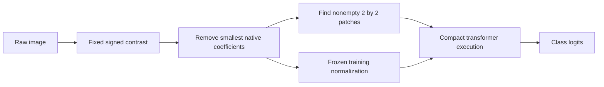

# Sparse contrast representations for image classification

**Do fixed contrast representations make image transformers faster and more robust when empty patches are removed?** This repository contains the implementation, experiment specifications, measured results, and figures for MNIST and CIFAR-10 with native-resolution ViT-Small and Swin-Tiny models.

The frontend is a fixed signed image transform. Training uses supervised cross-entropy; “contrast” here does not mean a contrastive-learning loss.

**Current finding:** the tested implementation does not deliver a useful general latency–accuracy improvement. Grayscale contrast improves MNIST brightness robustness, but overall corruption error worsens in the 60% comparisons. Compact Swin is substantially slower. Removing naturally empty patches also changes the computation of a dense-trained checkpoint, even at 0% imposed coefficient sparsity. These negative results are retained and explained, not hidden.

## Start with the three figures

| PDF | Contents |
|---|---|
| [MNIST errors](plots/MNIST_error_by_corruption.pdf) | Clean error and all 15 MNIST-C corruptions; one page per architecture |
| [CIFAR-10 errors](plots/CIFAR10_error_by_corruption.pdf) | Clean error and all 15 CIFAR-10-C corruptions, averaging the five severities within each seed |
| [Latency versus sparsity](plots/latency_vs_sparsity.pdf) | Both datasets and architectures together; batch-1 and batch-8 pages |

Black is the raw baseline: grayscale on MNIST and RGB on CIFAR-10. Purple is color opponency, orange single-color contrast, and blue grayscale contrast. Solid lines mean independently trained and tested at matched sparsity; dashed lines mean a **dense-trained** checkpoint tested with compact inference. MNIST has only its two valid representations. Error is lower-is-better everywhere in the classification PDFs. Curves show three-seed means and sample standard deviations.

The latency PDF uses milliseconds per batch from GPU-resident raw input through logits, **including the frontend**. Its follow-up curves are a dated partial snapshot with missing points left missing. All PDFs use Matplotlib/Seaborn and `dpi=300`; vector content remains vector. [Figure definitions, CSVs, and verification](plots/requested_comparisons/README.md).

## What was measured

| Study | Training and accuracy evaluation | Isolated timing |
|---|---|---|
| `training_sparse_testing_sparse` | 156 main runs, 52 conditions × 3 seeds, complete | 552 workers, complete |
| `training_dense_testing_sparse` | 60 existing source checkpoints; 612 inference cases and 35,352 official evaluation cells, complete | 2,424 planned workers; still running at publication |

Each official evaluation cell contains 10,000 images. The follow-up latency figure freezes the verified 2026-10-08 11:24:55 UTC snapshot, containing 62 complete three-seed dashed points out of 160. Live workers finishing later do not change that saved figure automatically. Historical batch-8 training is an archive, not pooled into the main larger-batch study. [Full protocol](docs/experiment_protocol.md).

At 60% imposed grayscale coefficient sparsity, trained and tested compact:

| Dataset / architecture | Raw clean accuracy | Gray 60% clean accuracy | Raw / gray mean corruption error | Raw / gray batch-1 latency |
|---|---:|---:|---:|---:|
| MNIST / ViT-Small | 98.300% | 97.883% | 27.104% / 37.118% | 10.088 / 10.915 ms |
| MNIST / Swin-Tiny | 99.233% | 99.037% | 24.035% / 28.738% | 18.195 / 26.047 ms |
| CIFAR-10 / ViT-Small | 78.103% | 68.403% | 35.560% / 54.314% | 10.186 / 10.888 ms |
| CIFAR-10 / Swin-Tiny | 87.787% | 79.853% | 31.020% / 44.355% | 18.306 / 34.919 ms |

Values are means over seeds 0, 1, and 2. Mean corruption error is **unnormalized error**, not an AlexNet-normalized index. Timings use the same A6000/EPYC 7413 hardware class and FP32 policy. [Results with uncertainty, lighting corruptions, losses, and batch-8 comparisons](docs/results.md).

## How it works



A 3×3 zero-padded box blur is subtracted from each color channel. The resulting signed local differences are represented as independent channel contrasts, their grayscale average, or fixed intensity/red–green/blue–yellow opponent channels. The smallest absolute native coefficients are set to zero per image. A patch disappears only when **every** coefficient in it is zero. Support is determined before affine normalization and positional embeddings.

ViT gathers retained tokens, preserves spatial positions, and pads each batch to its largest retained sequence. Swin groups active windows by exact length and propagates the union of child support through patch merging. This reduces some arithmetic but introduces packing, sorting, masking, synchronization, and many small kernel launches. Coefficient sparsity is not token sparsity, and later Swin stages often become almost dense again.

Read the detailed, source-linked explanations:

- [Every mathematical and implementation detail](docs/method.md): tensors, equations, tie-breaking, normalization, attention, positions, window shifts, merging, pooling, training, and controls.
- [Why speed and robustness did not improve](docs/performance_analysis.md): saved profiler evidence, retained-token counts, measured comparisons, limitations, and concrete next implementation changes.
- [Experimental protocol](docs/experiment_protocol.md): exact models, batches, optimizer recipes, splits, seeds, corruption coverage, timing boundaries, and checkpoint identities.
- [Reproduction and its limits](docs/reproducibility.md): portable analysis, package installation, immutable sources, datasets, and external checkpoints.

## Repository map

```text
analysis/       Portable reproduction of the three comparison PDFs
src/            Importable sparse_contrast and dense_sparse implementations
experiments/    Study specifications, resolved configurations, normalization fits
results/        Saved aggregate/seed tables and selected raw diagnostic evidence
plots/          Three main PDFs; indexed historical reports and diagnostic PDFs
provenance/     Immutable sources, environment locks, artifact and export manifests
docs/           Method, protocol, evidence, reproduction, and repository guide
scripts/        Publication export and integrity verification
debugging/      Requested chronological scratchpad and compact timing evidence
```

[Detailed layout and artifact policy](docs/repository_layout.md). The existing live Ceph experiment roots remain in place and are ignored by Git. The public layout is a documented publication snapshot, not a moved or silently rewritten active campaign.

## Reproduce the figures without a GPU

```bash
python -m venv .venv
source .venv/bin/activate
pip install numpy==2.2.6 matplotlib==3.10.7 seaborn==0.13.2
python analysis/reproduce_figures.py
```

This reads the committed CSV evidence and writes the three PDFs to `reproduced_plots/`. It validates seed coverage and aggregation before plotting. It does not need Torch, Ceph, datasets, or checkpoints. On a cluster, run the rendering command in a CPU allocation under site rules. Installation of the scientific package and exact environment restoration are described in [reproducibility](docs/reproducibility.md).

## Evidence and limitations

The original output directories contain approximately **908 GB** of logical files at the publication inventory, including roughly **128 GiB** of final/latest/validation-diagnostic checkpoints. They remain on the research filesystem. Datasets, checkpoints, exhaustive per-sample arrays, TensorBoard logs, large profiler traces, and operational logs are not embedded in this ordinary Git repository. Their local locations and coverage are recorded in [the artifact inventory](provenance/local_artifact_inventory.json); this is a metadata inventory, not a claim that every byte of a live tree was rehashed atomically.

All original frozen source identities are preserved under `provenance/sources/`. Public package path adaptations are recorded separately and do not change the model mathematics. Historical campaign launchers are path- and scheduler-bound; cloning this repository alone does not restore external checkpoints or make its old registry runnable elsewhere. The optional full-refit path was not used and has a documented alias mismatch; its archived presence is not a claim of successful execution.

[Attribution and licensing status](NOTICE.md) and [citation metadata](CITATION.cff). No unsupported license grant or claim of complete follow-up timing is made.
